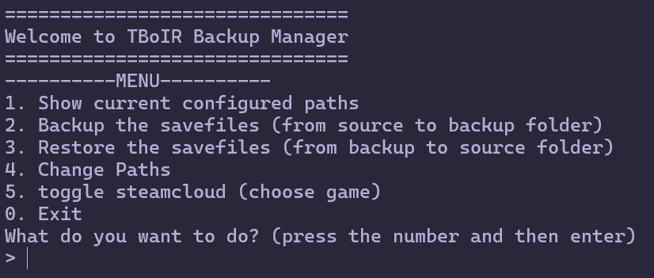
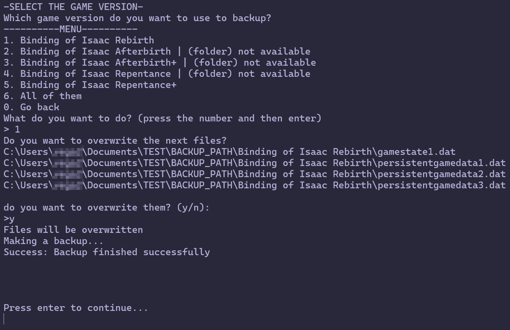

# TBoIR Backup manager

    

CLI backup manager that saves/restores game files across TBoI versions, with batch operations and cloud disable.

## What can it do?
- Make backups for each TBoIR version (Rebirth, Afterbirth, Afterbirth+, Repentance, Repentance+)
- Restore the made backups
- Make a batch backup or restore on installed versions of TBoIR
- Disable steam cloud from the program
- Change backup filepaths from the program and persist them
- Is compatible with mac, windows and linux

## Requirements
- Java 25 or higher
**Optional (for building a native-image):**
- Maven (for compilation)
- GraalVM (optional, for native-image)

## Installation

### Download the native-image
#### Linux
1. download the native-image: `isaac-backup-manager`
2. run it: `./isaac-backup-manager`

### Compile with Java
1. Clone: `git clone https://github.com/HecatesMoon/TBoIR-SaveFiles-Backup.git`
2. Go to java folder `cd src/main/java`
3. Compile program: `javac com/hecatesmoon/isaacbackupmanager/App.java`
4. Go to back to main folder: `cd ../../..`
5. Now you can run the program: `java -cp src/main/java com.hecatesmoon.isaacbackupmanager.App`

## You can also compile your own native-image with Maven and GraalVM
1. Clone: `git clone https://github.com/HecatesMoon/TBoIR-SaveFiles-Backup.git`
2. Use in main folder: `mvn clean package`
3. find your native-image in `./target`

## Tech Stack
- Java 25
- Maven
- GraalVM native-image

## Why did I do it
I made this project because I found a great opportunity to practice Java, I always wanted to do a useful app from zero, and wanted to get comfortable with Java. 
I also was playing The Binding of Isaac Rebirth and steam was overwriting my saves with empty saves, so I wanted something to save my games while not using steam cloud.

## To-do List
- GUI with JavaFX
- Cloud integration
- Automating processes
- Make multiple backups
